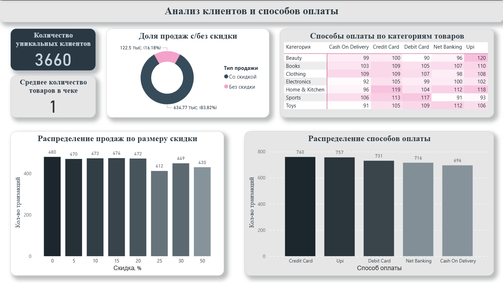

# Аналитический дашборд по продажам в E-commerce (Power BI)

Этот проект представляет собой дашборд, созданный в Power BI для анализа транзакционных данных в сфере e-commerce. Цель проекта - продемонстрировать полный цикл работы с данными: от очистки и моделирования до создания информативных визуализаций и поиска закономерностей.

### Демонстрация работы дашборда

### Ключевые выводы

Анализ данных позволил выявить несколько ключевых тенденций:

*   **Сезонность продаж:** наблюдаются пики продаж в апреле и октябре, а также заметный спад в июне и в ноябре.
*   **Лидер по выручке - не лидер по продажам:** категория 'Одежда' (Clothing) приносит наибольшую выручку в 115 тыс., в то время как по количеству проданных товаров лидирует 'Дом & Кухня' (Home & Kitchen). Это говорит о более высоком среднем чеке в категории 'Одежда'.
*   Подавляющее большинство продаж (84% от общей выручки) совершается с применением скидки.
*   **Предпочтения в оплате:** Кредитные карты (Credit Card) и система UPI являются самыми популярными способами оплаты, обеспечивая около 41% всех транзакций.
*   Система платежей UPI является лидером в категории Beauty, а максимальное количество транзакций по кредитным картам (Credit Card) приходится на категории 'Home & Kitchen' и 'Sports'.

### Скриншоты дашборда

#### Страница 1: Общая аналитика выручки и продаж
*Обзор ключевых финансовых показателей, динамики продаж и эффективности товарных категорий*

#### Страница 2: Анализ клиентов и способов оплаты
*Детализация по поведению клиентов, популярности способов оплаты и влиянию скидок*

### Инструменты и навыки

*   **Power BI Desktop**: основной инструмент для разработки.
*   **Power Query**: для извлечения, очистки и трансформации данных.
*   **DAX (Data Analysis Expressions)**: для создания вычисляемых столбцов и мер (`Общая выручка`, `Средний чек` и др.).
*   **Визуализация данных**: подбор оптимальных визуализаций для каждого показателя.

### Структура проекта

*   `ecommerce_analysis.pbix` - основной файл проекта Power BI.
*   `assets/` - папка с медиафайлами для README (GIF-анимация, скриншоты).

### Источник данных

Проект основан на наборе данных с платформы Kaggle, который имитирует типичные транзакции в сфере электронной коммерции. 

Его можно найти по ссылке: [e-commerce](https://www.kaggle.com/datasets/steve1215rogg/e-commerce-dataset/data?select=ecommerce_dataset_updated.csv)

Ключевые поля в наборе данных:

- User_ID - уникальный идентификатор пользователя
- Product_ID - уникальный идентификатор товара
- Category - категория товара
- Price - исходная цена товара
- Discount - процент скидки
- Final_Price - итоговая цена после применения скидки
- Payment_Method - способ оплаты
- Purchase_Date - дата покупки

